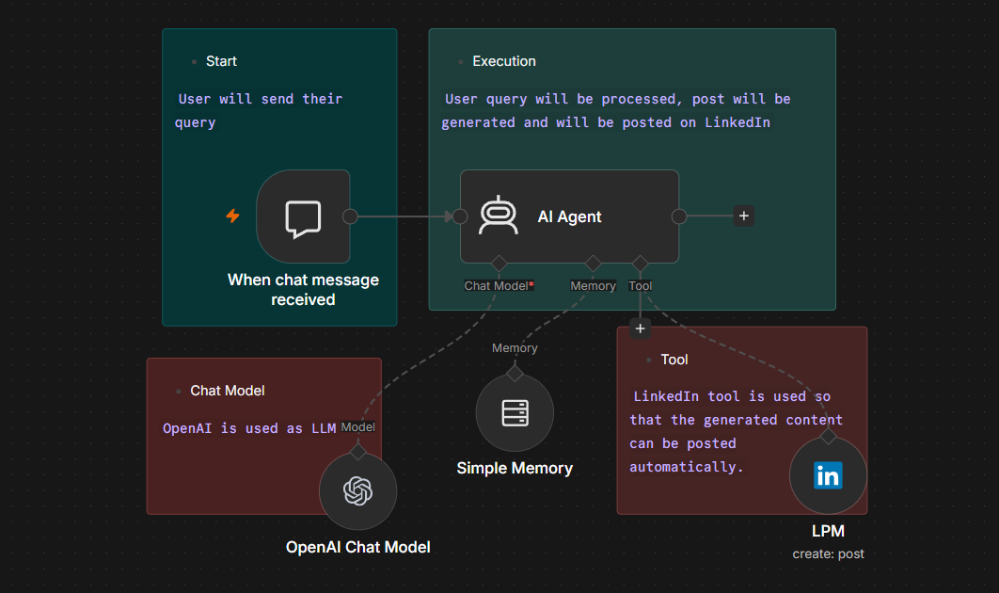

# AI-Powered LinkedIn Content Automation Agent

## What it does
Generates and publishes professional LinkedIn posts from a given topic, automating the full content pipeline.

## How it works
Topic input → AI Agent generates content using LLM → formats post → publishes via LinkedIn API.

## Tech stack
n8n, OpenAI/OpenRouter, LinkedIn API

## How to use
1. Import `My LinkedIn Agent.json` into your n8n instance
2. Add your own OpenAI/OpenRouter and LinkedIn API credentials
3. Activate the workflow

